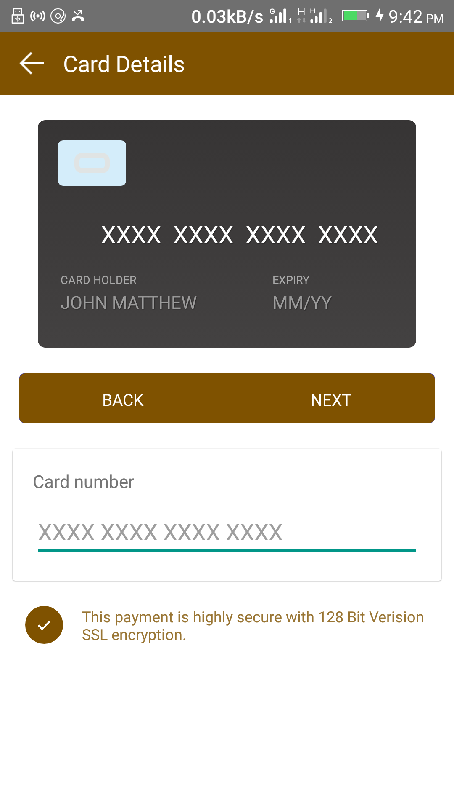
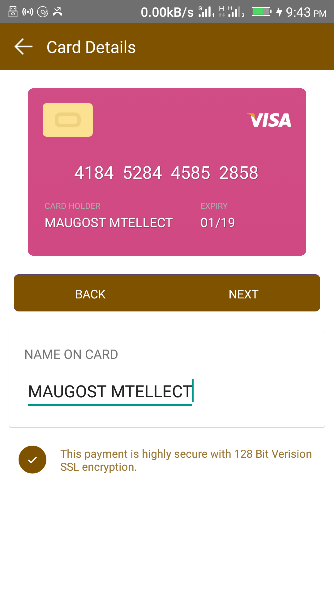
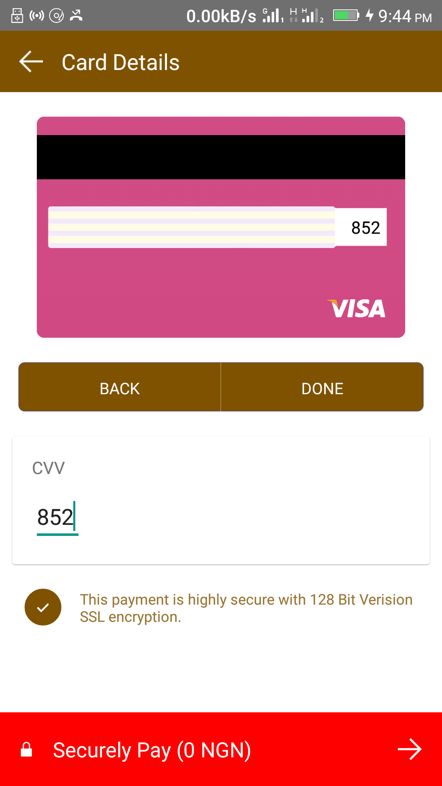
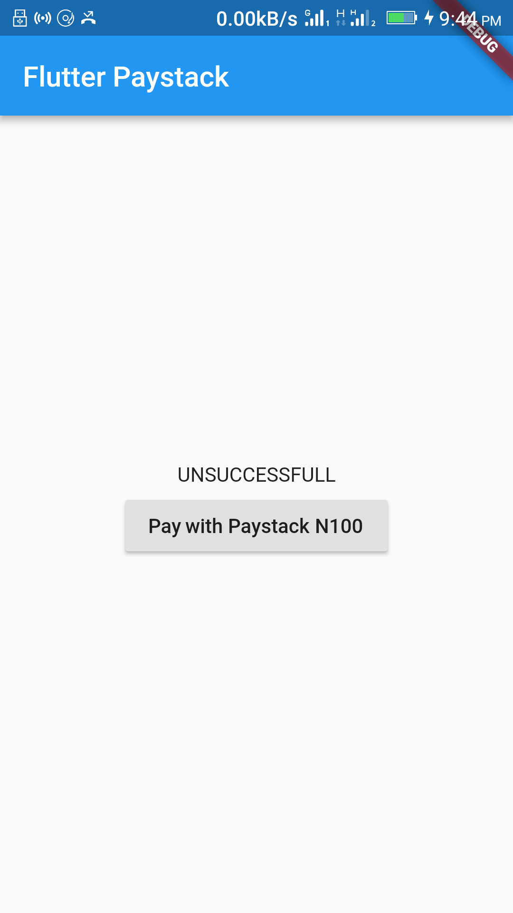
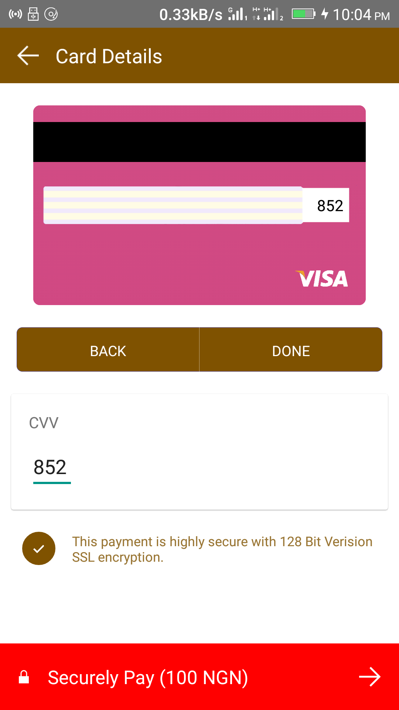

# Paystack Flutter Plugin

A Paystack Plugin for flutter developers for receiving payments online(Android currently supported, still working on the ios).

## Getting Started

For help getting started with Flutter, view our online
[documentation](https://flutter.io/).

For help on editing plugin code, view the [documentation](https://flutter.io/platform-plugins/#edit-code).

## Screenshots
       

## Usage

To use this package :

```yaml
  dependencies:
    flutter:
      sdk: flutter
    paystack_flutter:

## Connecting to Paystack
First, you should create define your paystack variables `PAYSTACK_PUBLIC_KEY`  and `BACKEND_URL` like this :
   
   
```dart
 static const paystack_pub_key = "Your_Paystack_Public_Key";
 static const paystack_backend_url = "https://infinite-peak-60063.herokuapp.com";
```


After the variables have been defined create a new function or method `connectPaystack` which is used to initialize flutter channel :

```yaml
 connectPaystack() async {
     String result;
     try {
       result = await PaystackFlutter.connectToPaystack({
         "NAME": "Your Name",
         "EMAIL": "you@email.com",
         "AMOUNT": 100,
         "CURRENCY": "NGN",
         "PAYMENT_FOR": "Testing API",
         "PAYSTACK_PUBLIC_KEY":paystack_pub_key,
         "BACKEND_URL": paystack_backend_url,
       });
     } on PlatformException catch (e) {
       result = e.message;
       print(e.message);
     }
 
     
     if (!mounted) return;
 
     setState(() {
       transcation = result;
     });
 }
```


## Paystack Channel Response codes

Listen for response via the result, with the response you can do as use please

```yaml
 } on PlatformException catch (e) {
        result = e.message;
        print(e.message);
}
```


For Successful transaction result is `SUCCESSFULL`
For Failed transaction result is `UNSUCCESSFULL`


## Complete Code Setup example

```yaml
 
import 'package:flutter/material.dart';
import 'package:flutter/services.dart';
import 'package:paystack_flutter/paystack_flutter.dart';

void main() => runApp(new MyApp());

class MyApp extends StatefulWidget {
  @override
  _MyAppState createState() => new _MyAppState();
}

class _MyAppState extends State<MyApp> {
  String transcation = 'No transcation Yet';
  Map<String, dynamic> _data = {};

  static const platform = const MethodChannel('maugost.com/paystack_flutter');
  static const paystack_pub_key = "Your_Paystack_Public_Key";
  static const paystack_backend_url =
      "https://infinite-peak-60063.herokuapp.com";

  @override
  initState() {
    super.initState();
  }

  @override
  Widget build(BuildContext context) {
    return new MaterialApp(
      home: new Scaffold(
        appBar: new AppBar(
          title: new Text('Flutter Paystack '),
        ),
        body: new Center(
          child: Column(
            mainAxisAlignment: MainAxisAlignment.center,
            children: <Widget>[
              new Text(transcation),
              new Padding(
                padding: const EdgeInsets.all(10.0),
                child: new RaisedButton(
                  child: new Text("Pay with Paystack N100"),
                  onPressed: connectPaystack,
                ),
              ),
            ],
          ),
        ),
      ),
    );
  }

  connectPaystack() async {
    String result;
    try {
      result = await PaystackFlutter.connectToPaystack({
        "NAME": "Your Name",
        "EMAIL": "you@email.com",
        "AMOUNT": 100,
        "CURRENCY": "NGN",
        "PAYMENT_FOR": "Testing API",
        "PAYSTACK_PUBLIC_KEY": paystack_pub_key,
        "BACKEND_URL": paystack_backend_url,
      });
    } on PlatformException catch (e) {
      result = e.message;
      print(e.message);
    }

    if (!mounted) return;

    setState(() {
      transcation = result;
    });
  }
}
```
